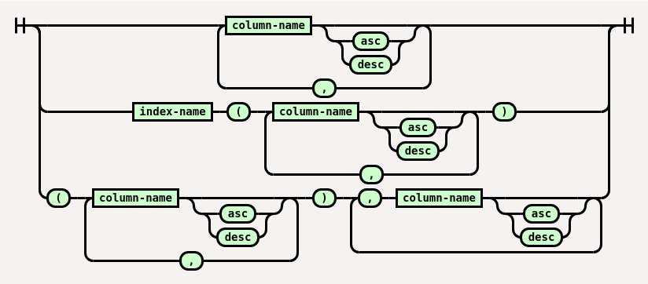

# mojoz


Manages relational database table metadata and query definitions.
Generates SQL [DDL](https://en.wikipedia.org/wiki/Data_definition_language) statements from table metadata.
Generates Scala classes or [XSD](https://en.wikipedia.org/wiki/XML_Schema_(W3C)) to receive query results.
Used by [querease](https://github.com/guntiso/querease) to save and retrieve data.

## Table metadata

Table metadata is typically loaded from YAML resource files bundled with application
(see [YamlTableDefLoader](https://static.javadoc.io/org.mojoz/mojoz_3/5.1.0/org/mojoz/metadata/in/YamlTableDefLoader.html)).
Table metadata can also be extracted from
[java.sql.DatabaseMetaData](https://docs.oracle.com/en/java/javase/11/docs/api/java.sql/java/sql/DatabaseMetaData.html)
using JDBC connection and saved to yaml files for later use
(see [JdbcTableDefLoader](https://static.javadoc.io/org.mojoz/mojoz_3/5.1.0/org/mojoz/metadata/in/JdbcTableDefLoader$.html)).

[Yaml 1.2](https://yaml.org/spec/1.2/) syntax is used for table metadata, but some keys and values are further parsed by mojoz and empty line is used as delimiter.
Key names are:

* **db** - database name
* **table** - table name
* **comments**
* **columns** - collection of columns
* **pk** - primary key. If not provided, might be implied (based on columns) to be `id` or `code` or a pair of refs,
  as defined in [MdConventions](https://static.javadoc.io/org.mojoz/mojoz_3/5.1.0/org/mojoz/metadata/io/MdConventions.html).fromExternalPk
* **uk** - collection of unique keys
* **idx** - collection of indices
* **refs** - collection of customized or additional references to columns (foreign keys)
* any other (custom) keys can be used and are sent to `extras` field of [TableDef](https://static.javadoc.io/org.mojoz/mojoz_3/5.1.0/org/mojoz/metadata/TableDef.html)
  by YamlTableDefLoader.

For example, table definition
```yaml
table:   person
columns:
- id
- name                 ! 51
- surname                52
- mother.id              person.id
- father.id              person.id
```
corresponds to the following sql (as converted by [DdlGenerator](https://static.javadoc.io/org.mojoz/mojoz_3/5.1.0/org/mojoz/metadata/out/DdlGenerator$.html)):
```sql
create table person(
  id bigint,
  name varchar(51) not null,
  surname varchar(52),
  mother_id bigint,
  father_id bigint
);

alter table person add constraint pk_person primary key (id);

alter table person add constraint fk_person_mother_id foreign key (mother_id) references person(id);
alter table person add constraint fk_person_father_id foreign key (father_id) references person(id);
```
### Columns

Column information is mostly contained in yaml string or key except for comment which is \[first string\] value for the key.
General pattern for column information is:
```
name [nullability] [type] [length_or_total_digits] [fraction_digits] [(enum)] [= default] [: comments]
```
where
* _name_ is column name or for refs - _table_name.column_name_ or _alias.column_name_ (dot (.) is replaced with underscore(\_) to create column name)
* _nullability_ is optional exclamation mark (!) meaning **not** null
* _type_ is optional type name or for refs - optional _table_name.column_name_
* _length_or_total_digits_ is optional column length or total digits for number columns
* _fraction_digits_ is optional fraction digits for decimals
* _enum_ is optional list of comma and/or space separated values for the column (to enable spaces in values, all values should be wrapped in single quotes ('))
* _default_ is optional default value for the column
* _comment_ is optional text
* additionally, any (custom) keys can be used and are sent to `extras` field of [ColumnDef](https://static.javadoc.io/org.mojoz/mojoz_3/5.1.0/org/mojoz/metadata/ColumnDef.html)
  by YamlTableDefLoader.

### Indices (pk, uk, idx)



If index name is not provided [DdlGenerator](https://static.javadoc.io/org.mojoz/mojoz_3/5.1.0/org/mojoz/metadata/out/DdlGenerator.html) uses
[ConstraintNamingRules](https://static.javadoc.io/org.mojoz/mojoz_3/5.1.0/org/mojoz/metadata/out/DdlGenerator$$ConstraintNamingRules.html)
to create automatic index name.

Examples:
```yaml
idx:
- id
- id, col1
- idx_col2(col2)
- idx_col3_col4(col3, col4)
- idx_col3_col5d(col3, col5 desc)
```

### Refs (foreign keys)

Refs are implied from column definitions where column name or type is _table_name.column_name_. Refs can be defined explicitly for: name customization, multi-column ref creation or _on delete_ / _on update_ settings.


If ref name is not provided [DdlGenerator](https://static.javadoc.io/org.mojoz/mojoz_3/5.1.0/org/mojoz/metadata/out/DdlGenerator.html) uses
[ConstraintNamingRules](https://static.javadoc.io/org.mojoz/mojoz_3/5.1.0/org/mojoz/metadata/out/DdlGenerator$$ConstraintNamingRules.html)
to create automatic ref name.

Examples:
```yaml
refs:
- bank_id -> bank(id) on delete cascade
- code, name -> table1(code, col1) on delete cascade
- fk_table2_custom_name(code, name) -> table2(code, col2)
```

## Types

Default supported types are defined in [mojoz-default-types.yaml](src/main/resources/mojoz-default-types.yaml).
Types can be customized and additional types can be added by including **mojoz-custom-types.yaml** file in resources.
Key names are:
* **type** - [mojoz] type name
* **_[some]_ name** - type name for specific purpose:
  * **scala name** - used by [ScalaGenerator](https://static.javadoc.io/org.mojoz/mojoz_3/5.1.0/org/mojoz/metadata/out/ScalaGenerator.html)
  * **xsd name** - used by [XsdGenerator](https://static.javadoc.io/org.mojoz/mojoz_3/5.1.0/org/mojoz/metadata/out/XsdGenerator.html)
  * any other (custom) name will also be loaded into
    `targetNames` field of [TypeDef](https://static.javadoc.io/org.mojoz/mojoz_3/5.1.0/org/mojoz/metadata/TypeDef.html)
    by [YamlTypeDefLoader](https://static.javadoc.io/org.mojoz/mojoz_3/5.1.0/org/mojoz/metadata/in/YamlTypeDefLoader.html)
* **jdbc** - type mappings from JDBC,
  used by [JdbcTableDefLoader](https://static.javadoc.io/org.mojoz/mojoz_3/5.1.0/org/mojoz/metadata/in/JdbcTableDefLoader$.html)
  to map jdbc type to mojoz type
  * **_[some db]_ jdbc** - db-specific type mappings from JDBC
* **yaml** - type mappings for table and view metadata loading from mojoz yaml files,
  used by [YamlTableDefLoader](https://static.javadoc.io/org.mojoz/mojoz_3/5.1.0/org/mojoz/metadata/in/YamlTableDefLoader.html)
  and [YamlViewDefLoader](https://static.javadoc.io/org.mojoz/mojoz_3/5.1.0/org/mojoz/metadata/in/YamlViewDefLoader.html)
* **sql** - type info used by [DdlGenerator](https://static.javadoc.io/org.mojoz/mojoz_3/5.1.0/org/mojoz/metadata/out/DdlGenerator$.html),
  can be overiden for specific database, for example:
  * **oracle sql** - type name specific to Oracle
  * **postgresql** - type name specific to PostgreSQL
  * **_[other db]_ sql** - any other keys ending with `sql` will also be loaded into
    `ddlWrite` field of [TypeDef](https://static.javadoc.io/org.mojoz/mojoz_3/5.1.0/org/mojoz/metadata/TypeDef.html)
    by [YamlTypeDefLoader](https://static.javadoc.io/org.mojoz/mojoz_3/5.1.0/org/mojoz/metadata/in/YamlTypeDefLoader.html)
    and can be used by corresponding sql generator.

Example:
```yaml
type:       euro
xsd name:   decimal
scala name: scala.math.BigDecimal
yaml:
- euro
sql:
- numeric(12, 2)
```

## [API docs](https://static.javadoc.io/org.mojoz/mojoz_3/5.1.0/org/mojoz/metadata/index.html)
